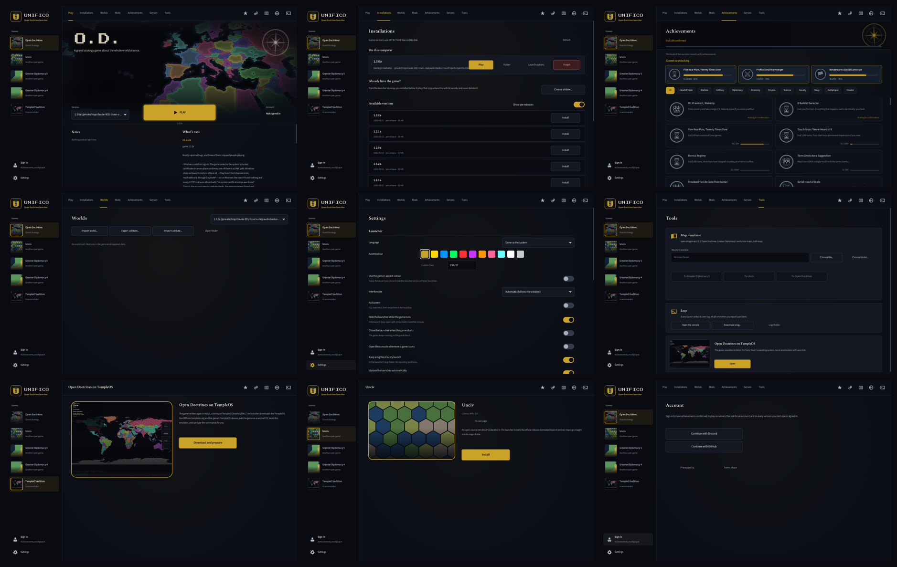

# Unifico

The launcher for [Open Doctrines](https://github.com/Pr1nted/Open-Doctrines).
It installs and updates the game, keeps several versions side by side, signs
you in once, and keeps track of your worlds, mods, servers and achievements.



It is a single C++ program of about 3.5 MB, built on raylib, for macOS,
Windows, Linux, FreeBSD and OpenBSD.

## What it does

| | |
|---|---|
| **Play** | The newest installed version, or any other, with one button. A Stop button while it runs, or the launcher hides until the game closes (your choice). |
| **Installations** | Every release, installed or removed with one click. Each one is checked against GitHub's SHA-256 before it unpacks. Shows disk use per version, plus launch options: extra arguments, environment variables, a memory limit, and whether to open the console. |
| **Already have the game?** | Point it at a copy you installed yourself. It plays that copy in place, with its worlds, and never deletes it. |
| **Worlds** | Rename, duplicate, export, import, delete, copy to another version, or play a world directly. Export or import a whole `.odstate`. |
| **Mods** | Turn installed mods on and off, remove them, install from a file or from the community directory. Directory downloads are checked against the author's declared checksum. |
| **Achievements** | The same collection the game shows. Only grants signed by the account service count, and each one is verified locally (see *Achievements* below). |
| **Servers** | The servers each version has joined, and an invite-code box. Starting one launches the game straight into it. |
| **Account** | Sign in once. Every version you start opens already signed in, and a sign-in made inside the game is picked up afterwards. The account's standing is shown too: every ban, timeout or restriction it has had, why, and when it ends. |
| **Admin** | For accounts with the developer badge only: write and edit the news board, work through the report queue, and look somebody up to time them out, ban or pardon them. The service checks the badge on every request; the launcher holds no secret. |
| **Settings** | The launcher's own settings, plus each version's `config.json` as a form. Keys the game adds later appear here without a launcher release. Also a disk-use report, privacy settings, and **Uninstall everything**. |
| **Tools** | The map translator ([open-dragoman](https://github.com/Pr1nted/dragoman), linked in): `.odmap` ↔ Greater Diplomacy 5 ↔ Unciv. Plus logs, the console, and downloading a log file. |
| **TempleOS edition** | One Play button. It checks that QEMU is installed and starts, fetches the TempleOS live CD and the game's TempleOS release, puts the game on a small FAT32 disk, boots QEMU and types its way into the game, watching the screen to know when each prompt is ready. Every step is also a button, for when the automatic start gets stuck. |
| **News** | The announcement board the game's main menu shows, from the same service. |

### The hidden shelf

Settings → About → click the version seven times. Unciv, Greater Diplomacy 5
and Greater Diplomacy 4 then appear in the games list:

- **Unciv**: official release builds, MPL-2.0.
- **Greater Diplomacy 5**: runs from its GPL-3.0 source in its own Python environment.
- **Greater Diplomacy 4**: a browser game on itch.io, so the launcher opens its page there.

Nothing from any of them is bundled.

## Achievements

A grant is an Ed25519 statement by the Open Doctrines account service. The
launcher, like the game, holds only the public keys (`-DOD_ACHIEVEMENT_KEYS`),
so it can check a grant but never make one. Unsigned or altered entries,
whether in a file or an imported `.odstate`, are ignored. The full design is
in Open Doctrines' `docs/achievements.md`.

## TempleOS

TempleOS 5.03 reads two filesystems: its own RedSea, and FAT32. A second CD in
ordinary ISO9660 mounts, and then answers every request with "File System Not
Supported". So the game goes on a 64 MB FAT32 hard disk that the launcher
writes itself (`utemple::writeFat32`), with no system tools needed. It is
rebuilt at every boot. The unattended start answers the two boot questions,
then runs `Mount` (drive letter `C`, probe, drive 1), `Cd("C:/");`, and
`#include "ODGame"` followed by `ODStart;`. The shell holds an `#include` until
the next statement arrives, so the two lines go together.

```bash
Unifico --templeos-disk <folder> <out.img>     # the disk, to inspect with ordinary tools
Unifico --templeos-selftest <out.ppm>          # boot, start the game, save the screen
```

## Updating itself

The order is chosen so that you are never left without a launcher:

1. Check that there is three times the download free on the launcher's own disk.
2. Download the update and verify its SHA-256.
3. Unpack it beside the running copy.
4. **The old copy clears macOS's quarantine attribute** on the new one
   (`removexattr`, no subprocess). Elsewhere it sets the executable bit.
5. The old copy starts the new one with `--finish-update` and exits.
6. The new copy waits for the old one to exit and migrates settings. It then
   deletes the old copy, renames itself to the old path, and restarts.

Data lives in the launcher's home folder, which every version shares, so no
files move. A `UnificoData` folder beside the app makes it portable.

## Building

```bash
cmake -S . -B build -DCMAKE_BUILD_TYPE=Release
cmake --build build -j8
cmake --build build --target UnificoTest && ./build/UnificoTest .
./build/Unifico.app/Contents/MacOS/Unifico --screenshots shots/   # every page as a PNG
```

What each platform needs:

- **Linux:** libcurl and X11/Wayland dev headers. raylib and open-dragoman are
  fetched at configure time.
- **macOS and the BSDs:** the system libcurl.
- **Windows:** nothing extra; HTTPS goes through WinHTTP.

## Translations

Unifico speaks every language Open Doctrines does, with the same table format:
English is the key.

```bash
python3 tools/extract_strings.py --od ../OpenDoctrines   # en.json + achievement names from the game
python3 tools/put_strings.py de < batch.json
```

## Privacy

On first start Unifico asks once whether it may send usage statistics, and the
default is no. If you say yes:

- It sends a fixed list of events (pages opened, version started, rough session
  length), with no text you typed.
- Events go through the account service to Google Analytics, so Google never
  sees your address.

See the "Launcher statistics" section of the
[privacy policy](https://opendoctrines-net.opendoctrines.workers.dev/privacy).

## Licence

Unifico is released under the same licence as Open Doctrines (`LICENSE`).

Bundled fonts, under the SIL OFL 1.1 (`assets/fonts/OFL.txt`):

- Source Sans 3
- Spectral
